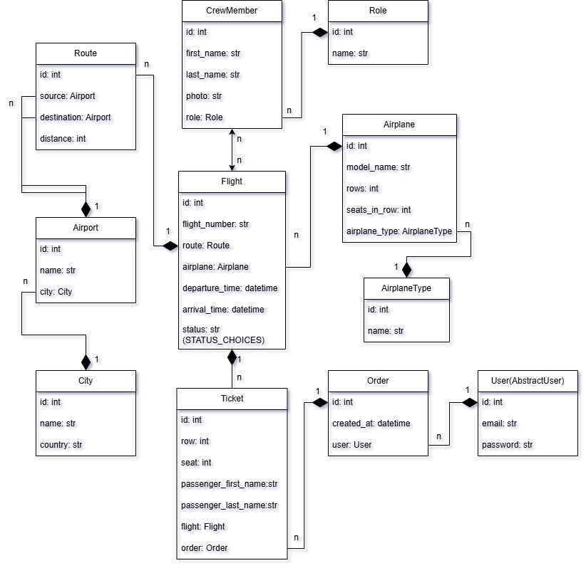
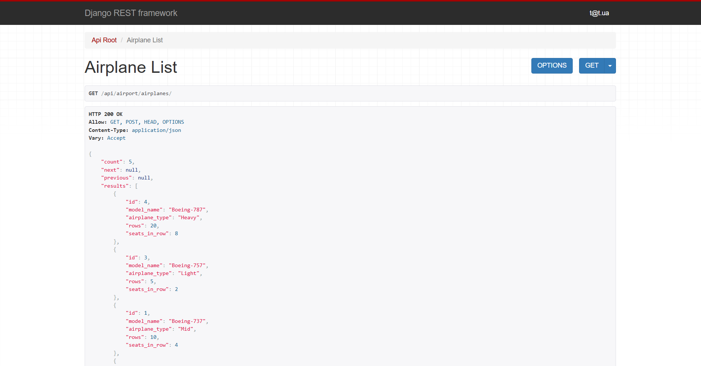

# ✈️ Airport API

A Django REST Framework-based API for managing airport operations including ticket booking.

## Check it out!

[Airport API deployed to Render](https://airport-api-ldyx.onrender.com/api/airport/)

## Features

- Managing and filtering cities, airports, routes, flights, roles, crew members, tickets and orders
- JWT-based authentication
- Admin panel /admin/
- Documentation at /api/doc/swagger/
- PostgreSQL database
- Dockerized for easy setup

## Tech Stack

- Python / Django / Django REST Framework
- PostgreSQL
- Docker & Docker Compose

# Installation
### Python 3 must be installed
1. **Clone the repository:**
   ```bash
   git clone https://github.com/mykola-tarasenko/airport-api.git
   cd airport-api
2. **Create and activate a virtual environment:**
   ```bash
   python -m venv venv
   source venv/bin/activate  # For Linux/Mac
   venv\Scripts\activate  # For Windows
3. **Install dependencies:**
    ```bash
   pip install -r requirements.txt
4. **Create a .env file:**
   ```bash
   cp env.sample .env
   ```
   - Open the .env file and fill in the required environment variables(DB variables).
   - **Important:** Since the database runs in a Docker container, set
   POSTGRES_HOST to the service name defined in your docker-compose.yml (for example, db).
5. **Start the database container:** Since the database is running
in a Docker container, start it using Docker Compose:
   ```bash
   docker-compose up -d db
   ```
   This will launch the PostgreSQL container in detached mode.
6. **Apply database migrations:** With the database container running, execute:
    ```bash
   python manage.py migrate
7. **Create a superuser (for accessing the admin panel):**
   ```bash
   python manage.py createsuperuser
8. **Start the development server:**
    ```bash
   python manage.py runserver
9. **Load test data (if needed):**
    ```bash
   python manage.py loaddata data.json

## Containerized Deployment (For Full Environment)

1. **Create and configure the .env file:**
   ```bash
   cp env.sample .env
2. **Build and run the containers:**
   ```bash
   docker-compose up --build
   ```
   This command will build the Docker images and start the
   containers for the web application and PostgreSQL database.

## Database Structure


## Demo

